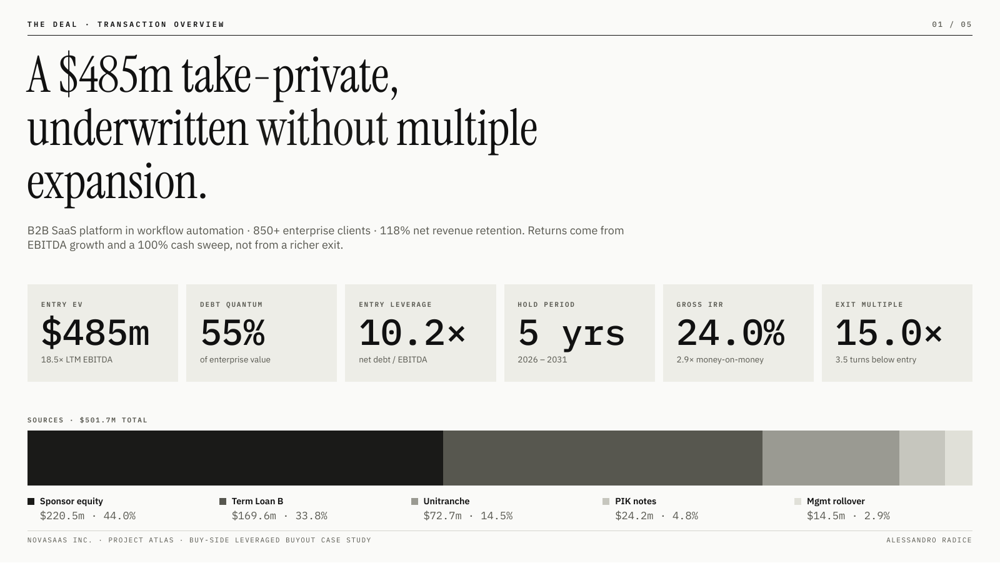
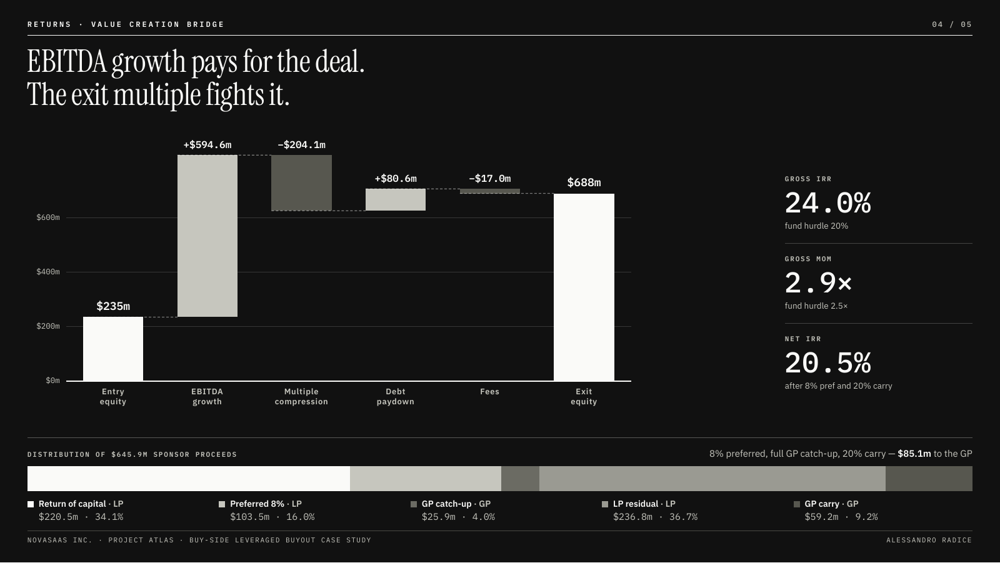
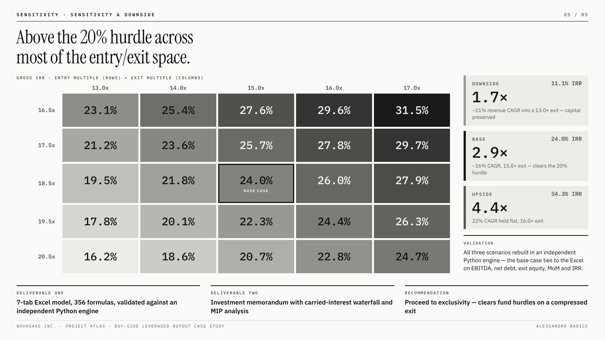

# SaaS LBO Model: NovaSaaS Inc.

**Author:** Alessandro Radice · M.Sc. Economics and Business Law (Finance), Università Cattolica del Sacro Cuore, Milan

**Can a sponsor pay 18.5x for a SaaS business and still clear its hurdles without a richer exit?**
A leveraged buyout of NovaSaaS Inc., a fictional B2B SaaS platform in workflow automation, built as a buy-side private equity case. It includes a **7-tab Excel model with live formulas**, an **investment memorandum** and a **presentation deck**.

---

## Objective

A private equity investment committee asks three questions about every buyout: how is the deal financed, where do the returns come from, and what happens if the plan goes wrong?

This project has three goals:

1. **Model the full buyout.** Sources & uses, a three-tranche debt package, five-year operating projections, a debt schedule with cash sweep and PIK accretion, exit and returns.
2. **Underwrite conservatively.** The exit multiple is set 3.5 turns below entry, so returns must come from EBITDA growth and deleveraging, not multiple expansion.
3. **Go beyond gross returns.** Net LP returns after an 8% preferred return, full GP catch-up and 20% carried interest, plus a management rollover and scenario analysis.

---

## Transaction at a glance

| | |
|---|---|
| Entry enterprise value | $485m (18.5x LTM EBITDA of $26.2m) |
| Debt package | $266.6m, 55% of EV, 10.2x EBITDA |
| Sponsor equity | $220.5m, plus $14.5m management rollover |
| Hold period | 5 years |
| Exit multiple | 15.0x (3.5 turns below entry) |

| Tranche | Amount | x EBITDA | Rate | Structure |
|---|---|---|---|---|
| Term Loan B | $169.6m | 6.5x | SOFR + 350 (8.8%) | 1% amortisation + 100% excess cash sweep |
| Unitranche / 2nd lien | $72.7m | 2.8x | 8.5% fixed | Bullet, repaid at exit |
| PIK toggle notes | $24.2m | 0.9x | 8.5% PIK | Accretes to principal |

---

## Key results

| Scenario | Revenue CAGR | Exit multiple | Gross IRR | Net IRR | MoM |
|---|---|---|---|---|---|
| Upside | 22% | 16.0x | 34.3% | 29.9% | 4.4x |
| **Base case** | ~16% | 15.0x | **24.0%** | **20.5%** | **2.9x** |
| Downside | ~11% | 13.0x | 11.1% | 9.3% | 1.7x |

- EBITDA grows from $26.2m to $58.3m and net leverage falls from 10.2x to 3.2x.
- The base case clears the fund hurdles (20% IRR, 2.5x MoM) while assuming multiple compression; the downside still returns 1.7x and preserves capital.
- Of $645.9m of sponsor proceeds, $85.1m goes to the GP through catch-up and carry.

---

## What's in the repository

| File | What it is |
|---|---|
| `NovaSaaS_LBO_Model.xlsx` | Excel model, 7 tabs, 356 formulas |
| `NovaSaaS_LBO_Memo.pdf` | Investment memorandum: thesis, structure, projections, returns waterfall, sensitivity, risks and mitigants |
| `NovaSaaS_LBO_Deck.pdf` | Five-slide presentation of the deal |
| `*.png` | Slides used in this README |

### The Excel model
`Cover` · `Assumptions` · `Income Stmt` · `Debt Schedule` · `FCF` · `Returns` · `Sensitivity`

- **Scenario switch:** one cell on `Assumptions` (1 = Downside, 2 = Base, 3 = Upside) changes the growth path and exit multiple across the whole model.
- **Debt schedule:** interest on opening balances, TLB mandatory amortisation plus a 100% excess-cash-flow sweep, unitranche bullet, PIK accretion at 8.5%.
- **Returns:** exit equity, gross IRR and MoM, and a full LP/GP distribution waterfall with net IRR and net MoM.
- **Sensitivity:** gross IRR across entry and exit multiples; the base case ties exactly to the `Returns` tab.

---

## Methodology

- **Operating case:** revenue growth decelerating from 22% to 11%, EBITDA margin expanding from 54.5% to 57.5%, D&A 3% and CapEx 2.5% of revenue, cash taxes at 25% on positive EBT only.
- **Rates:** SOFR modelled at 5.3%, deliberately above current levels, so the floating leg is conservative.
- **Waterfall:** return of capital, 8% compounded preferred return, full GP catch-up, then an 80/20 split. Net IRR comes from LP cash flows, not a flat haircut to gross.
- **Validation:** the three scenarios were rebuilt in an independent Python engine; the base case ties to the Excel on EBITDA, net debt, exit equity, MoM and IRR.

## Limitations

- NovaSaaS is fictional and all figures are hypothetical.
- Annual model with no quarterly covenant testing.
- The 10% management incentive pool on gains is excluded from sponsor returns.
- Exit assumed at the end of year 5 through a sale; no dividend recap or IPO scenario.

This project is for educational purposes and is not investment advice.

---

## How to use it

1. Download `NovaSaaS_LBO_Model.xlsx` and open it in Microsoft Excel or Google Sheets.
2. On `Assumptions`, change the scenario cell to 1, 2 or 3, or edit the entry multiple, leverage, rates or growth path. Every tab recalculates.
3. Read `NovaSaaS_LBO_Memo.pdf` for the investment case.

## Tools

`Excel` · `LBO modeling` · `Debt schedule` · `Distribution waterfall`
